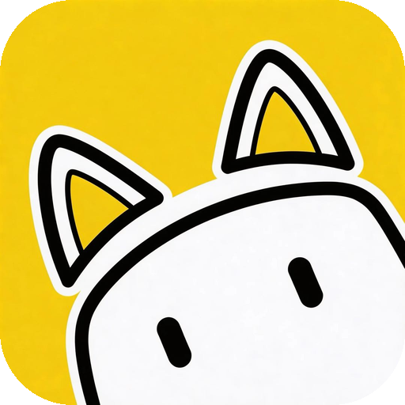

<p align="center">
  
</p>
<h1 align="center">OC-Claw</h1>
<p align="center">
  
</p>
<p align="center">
  <a href="./README.md">English</a> | <a href="./README.zh.md">中文</a> | <a href="./README.ja.md">日本語</a> | <a href="./README.ko.md">한국어</a> | <a href="./README.es.md">Español</a> | <b>Français</b>
</p>
<p align="center">
  Animal de bureau qui surveille vos agents de programmation IA, compatible macOS et Windows.
</p>

<p align="center">
  
</p>

## Installation

Téléchargez la dernière version depuis **[oc-claw.ai](https://www.oc-claw.ai)**.

## Fonctionnalités

- Réagit en temps réel à l'activité des agents OpenClaw / Claude Code (en cours, inactif, en attente)
- Un personnage vit sur votre bureau (macOS / Windows), s'anime quand les agents travaillent et dort quand ils sont inactifs
- Détecte automatiquement les agents OpenClaw locaux, affiche les listes de sessions, l'historique des conversations et les graphiques d'appels/tokens quotidiens
- Écoute les sessions locales de Claude Code via des hooks, visualise les conversations en direct
- Connexion aux instances OpenClaw sur des serveurs distants via SSH
- Animations personnalisées, associez différents agents à différents personnages
- Arrière-plans d'île personnalisables avec outil de recadrage
- Effets sonores de fin et d'attente

## Prérequis

- macOS ou Windows
- [OpenClaw](https://github.com/nicepkg/openclaw) et/ou [Claude Code](https://docs.anthropic.com/en/docs/claude-code) installé

## Comment ça marche

```
OpenClaw Agents ──→ Fichiers de session JSONL ──→ Sondage de santé ──→ État d'activité
Claude Code     ──→ Hooks (SessionStart/Stop) ──→ Parseur d'événements ──→ État d'activité
                                                                                ↓
                                          Sprites animés ← Machine à états ← Effets sonores
```

OC-Claw sonde les fichiers de session OpenClaw pour détecter l'activité des agents, et écoute Claude Code via les hooks installés. Les états d'activité pilotent les animations de personnages sur l'île de l'encoche, avec un panneau extensible pour les détails de session, l'historique des conversations et les métriques.

## Stack Technique

- **Tauri v2** + **React** + **TypeScript** — frontend
- **Rust** — backend pour l'interaction système, le tunneling SSH et la communication API
- APIs natives macOS / Windows pour la gestion des fenêtres

## Développement

```bash
cd frontend
npm install
npx tauri dev
```

## Contribuer

Les rapports de bugs, suggestions de fonctionnalités et pull requests sont les bienvenus.

## Crédits

- [Notchi](https://github.com/sk-ruban/notchi) — inspiration de design pour le concept de compagnon d'encoche et l'île herbeuse

## Licence

MIT

---

<p align="center">
  <sub>Créé à l'origine lors du KAON Hackathon</sub>
</p>
